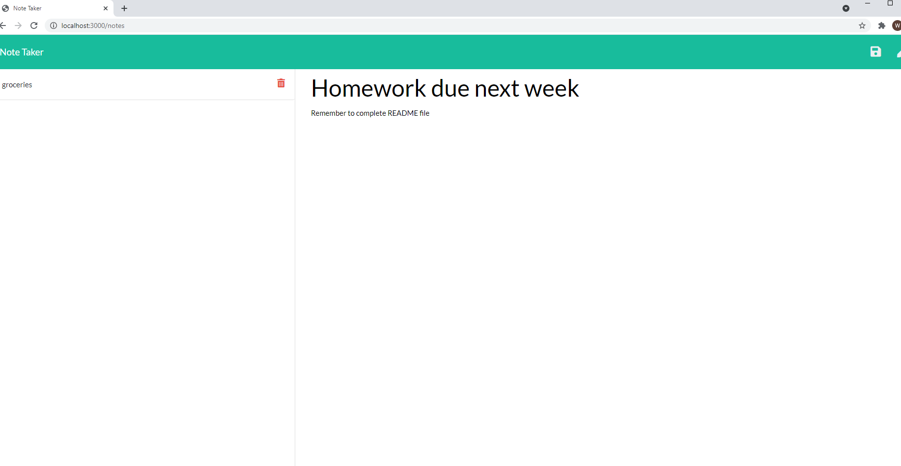
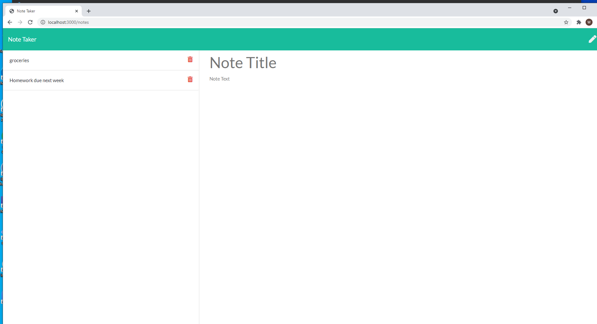

# Note Taker Application

## Description

This is a program that demonstrates both Get and Post API routes. The user can navigate to the note-taking page through the 
homepages, and input a title and body of the note. Once the click button is saved, the notes are stored and the history of 
recorded notes are displayed on the left-hand column of the notes page.

### Technology Used

Javascript, Node.JS, Express, Bootstrap, HTML, CSS

### Visuals

### Links
Github Repository:
[githubRepository]  https://will98nicholson.github.io/note_taker/
Deployed Heroku:
[deployedHeroku] https://stormy-harbor-56165.herokuapp.com/
